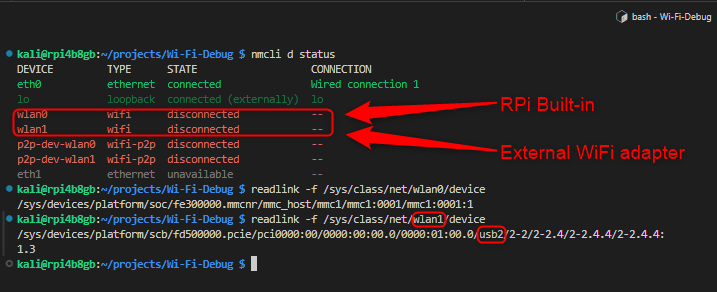

# WiFi Debug Project

---

## Warnings

1. **Disconnect the external USB WiFi adapter** before powering on the Raspberry Pi for the **first time**
   > To prevent applying the `OS Customization SSID settings` to the external adapter instead of the built-in RPi adapter.  
   > This applies if the goal is to use the external adapter in monitor mode instead of SSID connection.  
   > There are solution if the external adapter is connected during the first boot, but it is more complex.

## Hardware

1. Raspberry Pi with Power Supply - Tested with RPi 4B
2. (Optional) External USB WiFi adapter such as Alfa AWUS036AXML,
   if the internal WiFi adapter is not capable of monitor mode

## Tools on Host Machine

1.  vscode [download link](https://code.visualstudio.com/download) with recommended plugins:

    1. C/C++ & C/C++ Extension Pack
    2. Python & Python Debugger & Pylint & Pylance & isort (from Microsoft)
    3. CMake & CMake tools
    4. Black Formatter - Python
    5. Python Environment Manager
    6. GitHub Co-Pilot & Chat (if available)
    7. shell-format
    8. Prettier - Code formatter
    9. GitLens

2.  Wireshark

## Tools on RPi

1.  Linux OS installed on Raspberry Pi that supports the external USB WiFi adapter
    (e.g., Raspberry Pi OS, Ubuntu, etc.)
2.  git
3.  airodump-ng
4.  tshark

## Setup WiFi Debugging and Capture in Monitor Mode with RPi

1.  Install RPi OS on the Raspberry Pi with the **External USB WiFi adapter Disconnected**

    Raspberry Pi Imager with OS Customization tool can be used to install the OS on the RPi:  
    [Link](https://www.raspberrypi.com/software/)

    For headless setup use the **OS Customization tool** to provide the following:

    1. Hostname
    2. Username & Password
    3. SSID & SSID_Password
    4. Enable SSH

    
    

2.  Find the IP address of the RPi using the router's admin page or other methods

3.  SSH into the RPi using vscode with the IP address of RPi  
    SSH with vscode tutorial [here](https://code.visualstudio.com/docs/remote/ssh-tutorial)

    
    

4.  Install git:
    `sudo apt-get install git`

5.  Set up the git user name and email:  
    `git config --global user.name "Your Name"`  
    `git config --global user.email "Your Email"`

6.  Clone or download this repository from GitHub:
    `git clone git@github.com:sal515/Wi-Fi-Debug.git`

    (Optional) Update ~/.bashrc or ~/.profile to include GitHub ssh keys

    ```
        # Geneate SSH keys on the RPi
        ssh-keygen -t ed25519 "salman@email.com"
        # Add the generated ~/.ssh/<name>.pub to the GitHub SSH Keys list

        # Update the ~/.bashrc or ~/.profile based on the type of terminal used
        # Enables the ssh-agent and add the ssh key to the agent for new terminals

        echo "sourced: .bashrc (non-login shell)"
        echo "enable ssh-agent and add sal515 github key"
        eval "$(ssh-agent -s)"
        ssh-add ~/.ssh/sal515_github
    ```

7.  Run the following scripts without any args to create the symbolic links for the scripts in `Wi-Fi-Debug` directory:

    > `rpidbg` will be created for **wifi_debug_rpi_commands.sh**  
    > `wifidbg` will be created for **wifi_debug_commands.sh**

    ```
        cd ~/<path>/Wi-Fi-Debug
        bash ./wifi_debug_commands.sh
        bash ./wifi_debug_rpi_commands.sh
        ls /usr/local/bin/
    ```

8.  (Optional) For passwordless SSH login:

    1.  Generate SSH key on Windows or other Host machine

        > Windows 10 command from terminal: `ssh-keygen`

    2.  Add the public key to the RPi's `~/.ssh/authorized_keys` and enable ssh pub key usage using the following command:

        ```
           rpidbg -rpi-ssh-key "<ssh public key>"
        ```

    3.  On Host machine, add the private key to the ssh config:

        > vscode ssh config file reference: [Link](https://code.visualstudio.com/docs/remote/ssh#_remember-hosts-and-advanced-settings)

            ```
               Host <remote connection identifier>
                 HostName <remote hostname or remote ip>
                 User <remote username>
                 Port <remote port if using port forwarding **otherwise do not define**>
                 IdentityFile <path to ssh private key that was generated with the .pub>
                 ForwardAgent <yes or no>
                 ForwardX11 <yes or no>
                 ForwardX11Trusted <yes or no>
            ```

    4.  To test the remote connection can be closed and reopened without password prompt

9.  If the goal is to capture frequently in monitor mode

    1.  Connect RPi over ethernet
    2.  Find the **IP address** of the **RPi over Ethernet**  
        At this point the RPi will have 2 different IP from the DHCP of the Router  
        One with wlanX interface and another with the Ethernet interface
    3.  SSH into the RPi over Ethernet
    4.  Find the wlanX that was used prior for the SSH connection and disable it using nmcli

        ```
        nmcli d status
        rpidbg -rpi-wlan-discon wlanX
        ```

    5.  At this time this needs to be done on every reboot of the RPi with ethernet connected
    6.  TODO FIXME Add the disable command to bashrc so on every reboot with ethernet connected the wlanX is disabled automatically

10. Set the external or internal WiFi adapter in monitor and set the channel to capture packets

    1. Find the external adapter interface name (eg. wlan1)

       ```
           nmcli d status
           readlink -f /sys/class/net/wlanX/device
       ```

       

    2. Run the following commands to set the external adapter in monitor mode and set the channel to the SSID pattern provided

       ```
       rpidbg -rpi-wlan-set-mon-ch "wlanX" "ssid_regex_pattern_or_ssid_name"
       ```

       > Note: This also installs `airodump-ng` & `tshark` if not already installed

11. If `TLS Decryption` is required, samba can be setup to share the SSLKEYLOGFILE easily with Host machine's Wireshark

    > We will be using the Host machine's Wireshark installation to view the tshark data shared over ssh to the Host

    1. Execute the following to `install and setup samba` on RPi, the shared directory will be `~/rpi_share`

       ```
       rpidbg -rpi-samba-setup
       ```

    2. Execute `ifconfig` or `ip a` on the RPi to find the Ethernet IP address of the RPi
    3. On Host machine create a drive map to the shared samba directory of RPi

       ```
       \\<rpi_ethernet_ip>\rpi_share
       ```

       > Note: This is the directory where the `SSLKEYLOGFILE=ssl_key_log.log` will be stored when using Mitmproxy`

    4. On Host machine, set the Wireshark to use the `\\<rpi_ethernet_ip>\rpi_share\ssl_key_log.log` from the shared directory

       ```
       Edit -> Preferences -> Protocols -> TLS -> (Pre)-Master-Secret log filename -> `\\<rpi_ethernet_ip>\rpi_share\ssl_key_log.log`
       ```

       > Example: `Z:\ssl_key_log.log`F

## USB WiFi Adapter Info

1. Alfa AWUS036AXML [Link](https://www.alfa.com.tw/products/awus036axml?variant=39754360684616)
   - Chipset: MediaTek MT7921AUN
   - IEEE 802.11 standards: a/b/g/n/ac/ax (Tri-band)
   - Bluetooth: 5.2
   - Monitor Mode: Supported
   - Power consumption: 2.7 Watts (max.) with 5V
   - OS Support: RPi OS [version: **bookworm**] has the driver pre-installed
